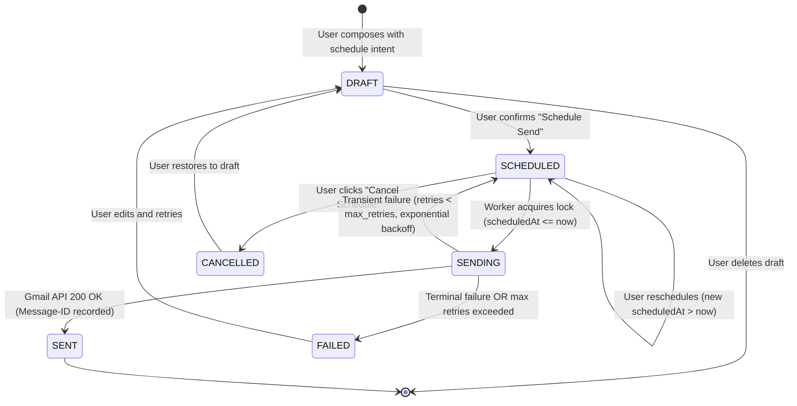

# RFC-001: Scheduled Email Architecture & State Model

| Metadata | Details |
| :--- | :--- |
| **Status** | **Approved / Specified** |
| **Author** | Priora Architecture Team |
| **Related Milestone** | [Milestone 1 — Scheduled Email](https://github.com/aali2k7/priora/milestone/1) |
| **Related Issue** | [Issue #1 — Design Scheduled Email Architecture & State Model](https://github.com/aali2k7/priora/issues/1) |
| **Target Implementation** | [Issue #2](https://github.com/aali2k7/priora/issues/2), [Issue #3](https://github.com/aali2k7/priora/issues/3), [Issue #4](https://github.com/aali2k7/priora/issues/4) |

---

## 1. Executive Summary & Problem Statement

Currently, Priora dispatches user emails synchronously via the Gmail REST API endpoint (`/api/gmail/send`). However, high-leverage executives frequently draft communications outside business hours (late evenings, weekends) and require scheduled delivery aligned with recipient timezones and working hours.

This RFC defines the complete architectural blueprint for Priora's **Scheduled Email System**, including:
1. A deterministic lifecycle state model.
2. PostgreSQL persistence schema with Prisma.
3. An idempotency framework preventing duplicate sending under race conditions or worker failover.
4. Timezone normalization and Daylight Saving Time (DST) handling.
5. Cancellation and rescheduling semantics.
6. Error classification and exponential backoff retry algorithms.
7. Security, encryption at rest, and zero-raw-binary privacy guarantees.

---

## 2. Deterministic Lifecycle State Model

### 2.1 State Definitions

| State | Description | Invariants & Guardrails |
| :--- | :--- | :--- |
| `DRAFT` | Email is being drafted with scheduling metadata. Not yet queued for dispatch. | Can be modified freely or discarded. No background delivery worker will touch this record. |
| `SCHEDULED` | Email composition is complete and locked in the schedule queue for future dispatch at `scheduledAt` (UTC). | Immutable unless explicitly rescheduled or cancelled by the user. |
| `SENDING` | A delivery worker has acquired an exclusive distributed lock and is actively communicating with the Gmail REST API. | Write-locked. Cannot be cancelled or edited by the user. If a worker crashes, a lock lease timeout (5 minutes) triggers safe recovery. |
| `SENT` | Successfully dispatched via Gmail API. `sentGmailMessageId` and `sentAt` are permanently recorded. | Terminal state. Immutable. |
| `FAILED` | Terminal error occurred (e.g., revoked OAuth scope, invalid recipient address) or max retry limit exceeded. | Actionable error message stored. User can review, edit, and re-schedule. |
| `CANCELLED` | Explicitly cancelled by user prior to dispatch window. | Terminal state. Worker will never attempt dispatch. Can be converted back to `DRAFT`. |

---

### 2.2 State Transition Diagram



---

### 2.3 Transition Validation Matrix

| Current State | Target State | Permitted? | Transition Guard / Pre-condition |
| :--- | :--- | :---: | :--- |
| `DRAFT` | `SCHEDULED` | **YES** | `scheduledAt > NOW()` AND recipient/body valid |
| `SCHEDULED` | `SENDING` | **YES** | Atomic CAS: `scheduledAt <= NOW()` AND lock acquired |
| `SCHEDULED` | `CANCELLED` | **YES** | Atomic CAS: record is in `SCHEDULED` state |
| `SCHEDULED` | `SCHEDULED` | **YES** | User updates `scheduledAt` to a new future time |
| `SENDING` | `SENT` | **YES** | Gmail API returns valid `id` & `threadId` |
| `SENDING` | `SCHEDULED` | **YES** | Transient error AND `attempts < maxAttempts` |
| `SENDING` | `FAILED` | **YES** | Non-recoverable error OR `attempts >= maxAttempts` |
| `CANCELLED` | `SENDING` | ❌ **FORBIDDEN** | **Hard Guardrail**: Cancelled emails can NEVER be sent |
| `SENT` | `ANY` | ❌ **FORBIDDEN** | Sent state is completely immutable |

---

## 3. Data Model Specification (Prisma & PostgreSQL)

The `ScheduledEmail` model integrates seamlessly with Priora's existing `User` and `GmailAccount` entities:

```prisma
enum ScheduledEmailStatus {
  DRAFT
  SCHEDULED
  SENDING
  SENT
  FAILED
  CANCELLED
}

model ScheduledEmail {
  id                  String               @id @default(cuid())
  userId              String
  user                User                 @relation(fields: [userId], references: [id], onDelete: Cascade)
  accountId           String
  account             GmailAccount         @relation(fields: [accountId], references: [id], onDelete: Cascade)
  threadId            String?              // Optional reference to existing Thread if replying
  
  // Recipient & Content Metadata (Plaintext Only — Zero Raw Binaries)
  toEmails            Json                 // Array of recipient emails: ["client@example.com"]
  toNames             Json?                // Array of recipient names: ["Jane Doe"]
  ccEmails            Json?                // Array of CC emails
  bccEmails           Json?                // Array of BCC emails
  subject             String
  bodyTextEncrypted   String               @db.Text // AES-256-GCM encrypted sanitized plain text body
  
  // Scheduling & Timezone Information
  scheduledAt         DateTime             // Stored strictly in UTC
  userTimezone        String               // IANA timezone identifier, e.g. "America/New_York"
  userFormattedTime   String               // Human readable label at creation time, e.g. "Tomorrow at 8:00 AM"
  
  // Delivery State & Lifecycle
  status              ScheduledEmailStatus @default(DRAFT)
  idempotencyKey      String               // Unique client-generated key (UUIDv4)
  
  // Distributed Concurrency Locking
  lockWorkerId        String?              // Identifier of the worker holding the execution lock
  lockAcquiredAt      DateTime?            // Timestamp when lock was acquired
  
  // Execution & Diagnostics
  attempts            Int                  @default(0)
  maxAttempts         Int                  @default(3)
  lastAttemptAt       DateTime?
  lastErrorMessage    String?              @db.Text
  
  // Sent Confirmation Metadata
  sentGmailMessageId  String?              // Message ID returned by Gmail REST API
  sentGmailThreadId   String?              // Thread ID returned by Gmail REST API
  sentAt              DateTime?
  cancelledAt         DateTime?
  
  createdAt           DateTime             @default(now())
  updatedAt           DateTime             @updatedAt

  @@unique([accountId, idempotencyKey])
  @@index([status, scheduledAt])
  @@index([userId, status])
  @@index([accountId])
}
```

---

## 4. Idempotency & Duplicate-Send Prevention Framework

### 4.1 The Core Threat Model
Duplicate email dispatch destroys executive trust and cannot be "undone". Duplicate sends can occur due to:
1. Distributed workers polling the same due records simultaneously.
2. Worker crash / network timeout occurring after Gmail processes the send request but before the worker receives the HTTP response.
3. Rapid user double-clicks during scheduling.

### 4.2 Mathematical Mechanism for Exactly-Once Execution

#### Step 1: Atomic Compare-And-Swap (CAS) Lock Acquisition
When the background delivery processor runs, it acquires due items using an atomic database query with row-level locking:

```sql
-- Worker queries and locks exactly due items without blocking other workers:
WITH candidate AS (
  SELECT id FROM "ScheduledEmail"
  WHERE status = 'SCHEDULED'
    AND "scheduledAt" <= NOW()
    AND ("lockAcquiredAt" IS NULL OR "lockAcquiredAt" < NOW() - INTERVAL '5 minutes')
  ORDER BY "scheduledAt" ASC
  LIMIT 50
  FOR UPDATE SKIP LOCKED
)
UPDATE "ScheduledEmail"
SET status = 'SENDING',
    "lockWorkerId" = $workerId,
    "lockAcquiredAt" = NOW(),
    "attempts" = "attempts" + 1,
    "lastAttemptAt" = NOW()
FROM candidate
WHERE "ScheduledEmail".id = candidate.id
RETURNING "ScheduledEmail".*;
```

#### Step 2: Client-Side Deduplication via Gmail API RFC-2822 Headers
Before dispatching to the Gmail API (`users.messages.send`), Priora embeds a unique deterministically generated `Message-ID` header:

```http
Message-ID: <priora-sched-{accountId}-{idempotencyKey}@priora.ai>
X-Priora-Schedule-ID: {id}
```

#### Step 3: Crash Recovery & Pre-Send Verification
If a worker crashes while a record is in `SENDING` state and the 5-minute lease expires:
1. The recovering worker checks the Gmail account via `users.messages.list(q="rfc822msgid:priora-sched-{accountId}-{idempotencyKey}@priora.ai")`.
2. **If message exists in Gmail**: The message was already sent. The worker immediately transitions the record to `SENT` with the discovered Gmail ID, preventing duplicate dispatch.
3. **If message does NOT exist in Gmail**: The worker proceeds to execute the dispatch safely.

---

## 5. Timezone & Daylight Saving Time (DST) Normalization

### 5.1 The Timezone Problem
Executives operate across global timezones. A schedule of *"Send tomorrow at 8:00 AM"* means 08:00 in the executive's local context, not UTC. Storing naive timestamps causes catastrophic timing errors when Daylight Saving Time shifts occur between scheduling and dispatch.

### 5.2 Resolution Algorithm
1. **Client Resolution**:
   - The user selects a date (e.g. `2026-10-15`) and time (`08:00`).
   - The client captures the IANA timezone string: `Intl.DateTimeFormat().resolvedOptions().timeZone` (e.g., `America/New_York`).
2. **Server UTC Conversion**:
   - The server converts the wall-clock tuple (`date`, `time`, `ianaTimezone`) into an absolute UTC `Date` object using zone-aware calculations (`date-fns-tz` or Temporal API):
   ```typescript
   import { fromZonedTime } from "date-fns-tz";
   
   const scheduledUtc = fromZonedTime("2026-10-15 08:00:00", "America/New_York");
   // Yields exact UTC instant: 2026-10-15T12:00:00.000Z (EDT)
   ```
3. **Database Invariant**:
   - All queries and comparisons run against standard UTC `scheduledAt`.
   - The original `userTimezone` is retained for user display and rescheduling.

---

## 6. Cancellation & Rescheduling Semantics

### 6.1 Cancellation Flow
1. User clicks "Cancel Schedule" in the Outbox interface.
2. Atomic update executed:
   ```typescript
   const cancelled = await prisma.scheduledEmail.updateMany({
     where: {
       id: scheduledEmailId,
       userId: activeUserId,
       status: "SCHEDULED" // Invariant: Cannot cancel if already SENDING or SENT
     },
     data: {
       status: "CANCELLED",
       cancelledAt: new Date()
     }
   });
   
   if (cancelled.count === 0) {
     throw new Error("Email is currently being dispatched and can no longer be cancelled.");
   }
   ```

### 6.2 Rescheduling Flow
1. User selects a new future time `$newTime`.
2. Validation: `$newTime > NOW() + 60 seconds`.
3. Atomic update resets `scheduledAt = $newUtcTime`, `status = "SCHEDULED"`, `attempts = 0`, and clears error diagnostics.

---

## 7. Error Classification & Exponential Backoff

### 7.1 Error Taxonomy

| Error Category | HTTP Status / Code | Action | Retry Strategy |
| :--- | :--- | :--- | :--- |
| **Rate Limited** | `429 Too Many Requests` | Retry | Exponential backoff + Full Jitter |
| **Transient Server Downtime** | `500`, `502`, `503`, `504` | Retry | Exponential backoff (10s, 40s, 160s) |
| **Network Timeout** | `ETIMEDOUT`, `ECONNRESET` | Retry | Verify with RFC-2822 check then retry |
| **Expired OAuth Token** | `401 Unauthorized` | Refresh Token | Refresh Better Auth Google OAuth token and immediately retry once |
| **Revoked Permissions** | `403 Access Denied` | **Abort to FAILED** | Immediate terminal failure; notify executive |
| **Invalid Recipient** | `400 Bad Request` | **Abort to FAILED** | Immediate terminal failure; record validation details |

### 7.2 Backoff Algorithm
```typescript
function calculateBackoffDelayMs(attempt: number, baseMs = 10000, maxMs = 300000): number {
  const exponential = Math.min(maxMs, baseMs * Math.pow(2, attempt - 1));
  const jitter = Math.random() * (exponential * 0.2); // 20% jitter
  return Math.floor(exponential + jitter);
}
```

---

## 8. Security, Privacy & Compliance

1. **Zero Raw Binary Storage**: Scheduled emails only store sanitized plaintext (`bodyTextEncrypted`). Attachments remain metadata-only references or are fetched at runtime.
2. **Encryption at Rest**: `bodyTextEncrypted` is encrypted using AES-256-GCM with application-level key derivation before persisting to PostgreSQL.
3. **Session Invalidation**: If an executive signs out or disconnects their Gmail account, an automated cascade immediately transitions all pending `SCHEDULED` items to `CANCELLED`.
4. **Access Boundaries**: All API routes verify tenant isolation: `userId = session.user.id`.

---

## 9. Next Steps & Implementation Roadmap

With RFC-001 approved:
- **[Issue #2](https://github.com/aali2k7/priora/issues/2)**: Implement Compose Modal split send button & date-time picker UI.
- **[Issue #3](https://github.com/aali2k7/priora/issues/3)**: Implement the background delivery worker & Gmail API integration.
- **[Issue #4](https://github.com/aali2k7/priora/issues/4)**: Build the Outbox / Scheduled management dashboard.
