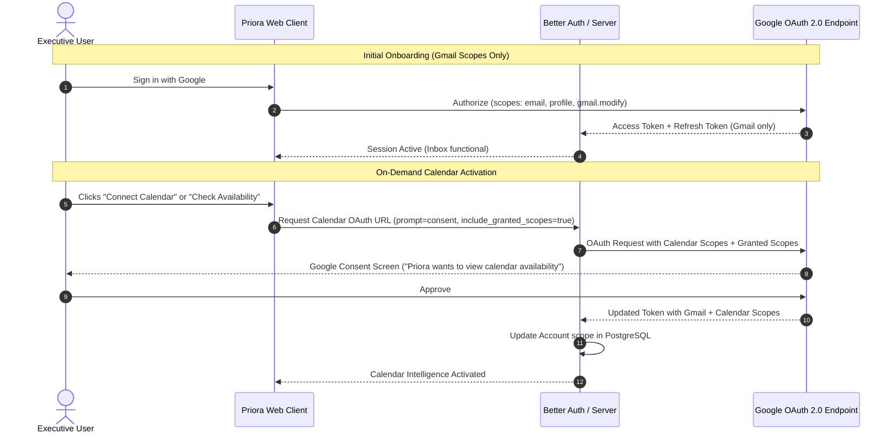

# RFC-002: Google Calendar OAuth Scopes & Security Architecture

| Metadata | Details |
| :--- | :--- |
| **Status** | **Approved / Specified** |
| **Author** | Priora Architecture & Security Team |
| **Related Milestone** | [Milestone 2 — Google Calendar Intelligence](https://github.com/aali2k7/priora/milestone/2) |
| **Related Issue** | [Issue #5 — Investigate Google Calendar OAuth Scopes & Security Architecture](https://github.com/aali2k7/priora/issues/5) |
| **Target Implementation** | [Issue #6](https://github.com/aali2k7/priora/issues/6), [Issue #7](https://github.com/aali2k7/priora/issues/7), [Issue #8](https://github.com/aali2k7/priora/issues/8) |

---

## 1. Executive Summary & Context

Priora is an intelligence layer over Gmail. To power meeting availability replies and one-click event creation, Priora requires integration with Google Calendar. However, executive calendars contain highly sensitive strategic data (board meetings, M&A discussions, private personnel syncs).

This RFC establishes the security and permission model for Google Calendar integration:
1. **Least-Privilege Scopes**: Requesting only what is necessary for free/busy detection and explicit event creation.
2. **Incremental Authorization**: Existing users are never prompted upfront; permissions are requested on-demand only when a user explicitly initiates a calendar feature.
3. **Graceful Revocation Resilience**: If calendar permissions are revoked or denied, Priora's inbox and AI brief remain 100% operational.
4. **Zero-Retention Privacy**: Calendar event details, summaries, and attendees are strictly never stored permanently in application databases.

---

## 2. Google OAuth 2.0 Scope Matrix

| Feature Domain | Google OAuth Scope | Access Level | Justification |
| :--- | :--- | :---: | :--- |
| **Availability Engine** | `https://www.googleapis.com/auth/calendar.freebusy` | Read Only | Used by the availability engine to query free/busy time slots without reading event titles, descriptions, or attendee rosters. |
| **Event Suggestion Creation** | `https://www.googleapis.com/auth/calendar.events` | Read / Write | Used solely when the executive clicks "Add to Calendar" to insert the confirmed event into their primary calendar. |

> **Security Guardrail**: Priora will NEVER request `https://www.googleapis.com/auth/calendar` (full root calendar control).

---

## 3. Incremental Authorization Flow

Instead of requiring Calendar permissions during initial signup, Priora employs Google's **Incremental Authorization** pattern (`include_granted_scopes: true`):



---

## 4. Token Storage & Multi-Scope Lifecycle

1. **Storage Invariant**:
   - OAuth tokens are stored in the PostgreSQL `Account` table managed via Better Auth.
   - The `scope` column tracks currently granted scopes (e.g. `openid email profile https://www.googleapis.com/auth/gmail.modify https://www.googleapis.com/auth/calendar.freebusy`).
2. **Token Refresh Protocol**:
   - `getValidAccessToken(userId)` automatically verifies token expiry.
   - If token is expired, a single refresh request against `https://oauth2.googleapis.com/token` refreshes the token across all authorized scopes simultaneously.
3. **Scope Verification Helper**:
   ```typescript
   export async function hasCalendarScope(userId: string): Promise<boolean> {
     const account = await prisma.account.findFirst({
       where: { userId, providerId: "google" }
     });
     if (!account || !account.scope) return false;
     return account.scope.includes("calendar.freebusy") || account.scope.includes("calendar.events");
   }
   ```

---

## 5. Revocation & Graceful Degradation

If an executive revokes calendar access from their [Google Account Permissions Dashboard](https://myaccount.google.com/permissions):
1. **Inbox & Email Functionality**: Completely unaffected. Gmail API operations continue uninterrupted.
2. **Availability Engine**: Intercepts Google API `403 Access Denied` or `401 Unauthorized` and falls back to manual scheduling mode.
3. **UI Feedback**: Calendar features display a non-intrusive badge: *"Calendar disconnected — Reconnect to enable automatic meeting availability"*.

---

## 6. Privacy Architecture & Zero-Retention Invariant

1. **Ephemeral Free/Busy Processing**:
   - Queries to `https://www.googleapis.com/calendar/v3/freeBusy` return only `{ start: ISO, end: ISO }` busy blocks.
   - Free slot calculations happen in-memory and are cached for a maximum of 60 seconds (in-memory TTL) to minimize Google API quota consumption.
   - **Zero calendar event data is written to PostgreSQL disk**.
2. **Prompt Sandboxing**:
   - When AI generates a meeting reply draft, only the computed free time slots (e.g. *"Thursday 2:00 PM - 3:00 PM EST"*) are passed into the prompt.
   - No past calendar history or private meeting subjects are ever transmitted to Gemini or Groq inference endpoints.

---

## 7. Next Steps & Downstream Tasks

With RFC-002 approved:
- **[Issue #6](https://github.com/aali2k7/priora/issues/6)**: Build the Calendar Availability & Free/Busy Intelligence Engine.
- **[Issue #7](https://github.com/aali2k7/priora/issues/7)**: Implement AI Meeting Availability Reply Generator.
- **[Issue #8](https://github.com/aali2k7/priora/issues/8)**: Build Email-to-Calendar Event Detection & One-Click Suggestions.
