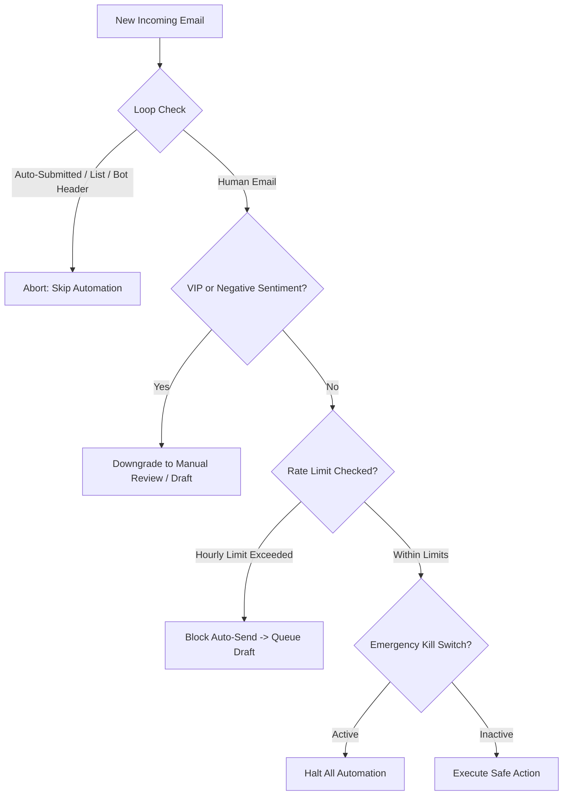

# RFC-003: Email Automation Rules Engine Architecture

| Metadata | Details |
| :--- | :--- |
| **Status** | **Approved / Specified** |
| **Author** | Priora Architecture Team |
| **Related Milestone** | [Milestone 3 — Automated Replies & Workflow Automation](https://github.com/aali2k7/priora/milestone/3) |
| **Related Issue** | [Issue #9 — Design Email Automation Rules Engine Architecture](https://github.com/aali2k7/priora/issues/9) |
| **Target Implementation** | [Issue #10](https://github.com/aali2k7/priora/issues/10), [Issue #11](https://github.com/aali2k7/priora/issues/11), [Issue #12](https://github.com/aali2k7/priora/issues/12) |

---

## 1. Executive Summary & Problem Statement

Executives handle repetitive email patterns daily (absence notices, supplier receipts, introductory scheduling inquiries). While manual triage is slow, uncontrolled AI autonomy poses severe business and reputational risks.

This RFC defines the architectural blueprint for Priora's **Declarative Email Automation Rules Engine**, ensuring:
1. Type-safe declarative rule conditions and action dispatchers.
2. Conflict resolution and VIP override hierarchies.
3. Non-destructive dry-run simulation mode.
4. Strict enterprise safety invariants, loop prevention, and global emergency kill switches.

---

## 2. Declarative Rule Schema

### 2.1 Condition Model

Rules evaluate a boolean expression of condition clauses (`AND` / `OR` logic):

```typescript
export interface RuleCondition {
  field:
    | "senderEmail"
    | "senderDomain"
    | "subject"
    | "category"
    | "priority"
    | "urgencyScore"
    | "sentiment"
    | "hasAttachments";
  operator:
    | "EQUALS"
    | "NOT_EQUALS"
    | "CONTAINS"
    | "NOT_CONTAINS"
    | "STARTS_WITH"
    | "IN"
    | "GREATER_THAN"
    | "LESS_THAN";
  value: string | number | string[];
}
```

### 2.2 Action Dispatcher Model

```typescript
export interface RuleAction {
  type:
    | "GENERATE_AI_DRAFT"
    | "APPLY_LABEL"
    | "AUTO_ARCHIVE"
    | "SCHEDULE_REPLY"
    | "SAFE_AUTO_SEND";
  parameters?: {
    tone?: "concise" | "formal" | "friendly" | "direct_refusal" | "request_call";
    promptTemplate?: string;
    labelName?: string;
    scheduleDelayMinutes?: number;
    allowlistDomains?: string[];
  };
}
```

---

## 3. Database Persistence Schema (Prisma)

```prisma
model AutomationRule {
  id              String          @id @default(cuid())
  userId          String
  user            User            @relation(fields: [userId], references: [id], onDelete: Cascade)
  name            String
  description     String?
  isActive        Boolean         @default(true)
  priorityOrder   Int             @default(0) // Higher integer = higher precedence
  
  // Declarative JSON definitions
  conditions      Json            // Array of RuleCondition
  actions         Json            // Array of RuleAction
  
  // Execution Metrics
  totalTriggered  Int             @default(0)
  lastTriggeredAt DateTime?
  
  createdAt       DateTime        @default(now())
  updatedAt       DateTime        @updatedAt

  logs            AutomationLog[]

  @@index([userId, isActive])
}

model AutomationLog {
  id              String          @id @default(cuid())
  ruleId          String?
  rule            AutomationRule? @relation(fields: [ruleId], references: [id], onDelete: SetNull)
  userId          String
  threadId        String?
  emailSubject    String?
  senderEmail     String?
  actionExecuted  String          // "DRAFT_GENERATED" | "AUTO_SENT" | "ARCHIVED" | "ABORTED"
  status          String          // "SUCCESS" | "BLOCKED_GUARDRAIL" | "ERROR"
  diagnostics     Json?           // Rule match evaluation details
  createdAt       DateTime        @default(now())

  @@index([userId, createdAt])
}
```

---

## 4. Conflict Resolution & Precedence Hierarchy

When multiple rules match a newly synced email:
1. **VIP Immunity**: If the thread involves a VIP sender, destructive actions (`AUTO_ARCHIVE`, `SAFE_AUTO_SEND`) are automatically downgraded to `GENERATE_AI_DRAFT` unless explicitly overridden.
2. **Precedence Ranking**: Rules execute in order of `priorityOrder` descending.
3. **Short-Circuit Invariant**: An email can trigger at most one reply action (`GENERATE_AI_DRAFT`, `SCHEDULE_REPLY`, or `SAFE_AUTO_SEND`) per sync event to prevent duplicate drafting.

---

## 5. Enterprise Safety Invariants & Guardrails



1. **Loop Prevention Protocol**: Headers `Auto-Submitted: auto-generated`, `List-Unsubscribe`, `Precedence: bulk`, and `X-Auto-Response-Suppress` immediately abort all reply automation.
2. **Negative Sentiment Bailout**: If AI sentiment analysis detects tension (`frustrated`, `urgent_complaint`, `legal_threat`), auto-replying is immediately blocked.
3. **Global Emergency Kill Switch**: A single setting toggle halts all automated dispatching across the application in sub-5ms.

---

## 6. Next Steps & Implementation Tasks

With RFC-003 approved:
- **[Issue #10](https://github.com/aali2k7/priora/issues/10)**: Implement Automatic AI Draft Generation on matching rules.
- **[Issue #11](https://github.com/aali2k7/priora/issues/11)**: Implement Safe Auto-Send with strict enterprise guardrails.
- **[Issue #12](https://github.com/aali2k7/priora/issues/12)**: Build the Automation Activity Log & Audit Trail.
