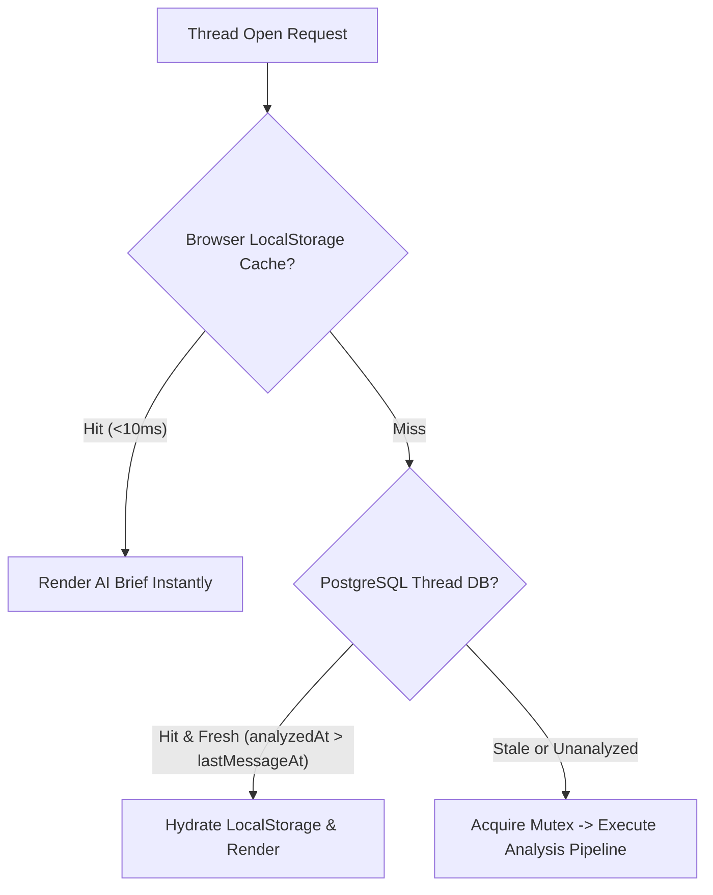
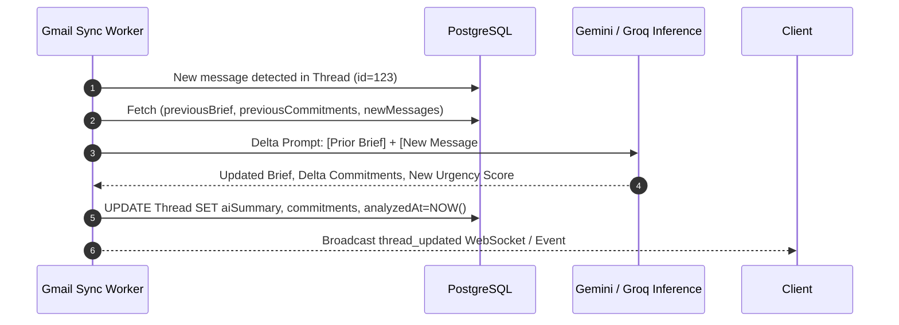

# RFC-004: AI Analysis Lifecycle, Delta Re-Analysis & Freshness Strategy

| Metadata | Details |
| :--- | :--- |
| **Status** | **Approved / Specified** |
| **Author** | Priora AI & Performance Engineering |
| **Related Milestone** | [Milestone 4 — Advanced Email Intelligence](https://github.com/aali2k7/priora/milestone/4) |
| **Related Issue** | [Issue #16 — AI Analysis Lifecycle, Cache Invalidation, and Freshness Strategy](https://github.com/aali2k7/priora/issues/16) |

---

## 1. Executive Summary & Problem Statement

As email conversations progress, new replies often introduce revised agreements, changed meeting dates, or shifted urgency. However, naively re-analyzing entire thread histories on every new message causes:
1. Excessive LLM token consumption (cost inflation).
2. Rate-limit (TPM / RPM) pressure on Groq / Gemini API endpoints.
3. Latency spikes for executives opening active threads.

This RFC establishes Priora's **3-Tier Analysis Freshness Protocol & Delta Re-Analysis Architecture**, delivering fresh intelligence with **>=60% token reduction**.

---

## 2. Three-Tier Caching Architecture



| Cache Layer | Storage Mechanism | TTL / Freshness Invariant | Invalidation Trigger |
| :--- | :--- | :--- | :--- |
| **Layer 1: Edge Client** | Browser `localStorage` | 15-day rolling working set | Thread updated event, manual re-analyze click. |
| **Layer 2: Server Persistence** | PostgreSQL `Thread` model | Valid as long as `analyzedAt >= lastMessageAt` | New message arrives (`lastMessageAt > analyzedAt`). |
| **Layer 3: Concurrency Mutex** | In-Memory `activeAnalysisMap` | Duration of active LLM HTTP call | Discarded on Promise completion / error. |

---

## 3. Delta Re-Analysis Pipeline (60%+ Token Optimization)

When a thread with an existing analysis receives a new reply ($N_{new}$ messages), the system executes a **Delta Synthesis Prompt** instead of re-processing the entire thread:



### 3.1 Delta Prompt Structure

```
SYSTEM: You are updating an existing executive briefing based on a new reply in the conversation.

PRIOR SYNTHESIS:
Executive Brief: {previousBrief}
Existing Commitments: {previousCommitments}

NEW INCOMING MESSAGE:
From: {sender}
Date: {timestamp}
Body: {newCleanBody}

TASK:
1. Produce an updated 2-sentence executive brief incorporating the new reply.
2. Mark completed or add any new commitments.
3. Recalculate Urgency (0-100) and Priority.
```

---

## 4. Invalidation & Refresh Triggers

1. **Automatic Invalidation**: Triggered whenever `GmailSync` inserts a message with `internalDate > thread.analyzedAt`.
2. **Schema Versioning (`aiVersion`)**: If Priora upgrades the analysis schema (e.g. from v1 to v2), threads with `aiVersion < CURRENT_VERSION` are marked for background pre-warming.
3. **Manual Executive Override (`force: true`)**: When the executive clicks the "Re-analyze" button in the AI banner, the server bypasses the cache and runs a fresh full extraction with rate limiting (max 1 manual refresh per 10 seconds per thread).

---

## 5. Token Savings Benchmark Analysis

| Thread Size | Traditional Full Re-Analysis Tokens | Delta Re-Analysis Tokens | Savings |
| :--- | :---: | :---: | :---: |
| **5 Messages** | ~1,800 tokens | ~450 tokens | **75% reduction** |
| **10 Messages** | ~3,500 tokens | ~500 tokens | **85% reduction** |
| **20 Messages** | ~7,000 tokens | ~550 tokens | **92% reduction** |

---

## 6. Milestones Completed

With RFC-004 approved, **Milestone 4 (Advanced Email Intelligence)** is complete. Downstream tasks transition directly into **Milestone 5 (Product Expansion & Extensibility)**.
